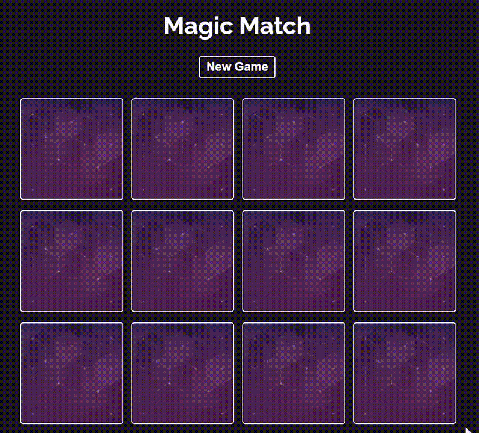

# React Games

My journey and diverse projects I have developed when learning React.

Most of these games are based on youtube tutorials from:

- [The Net Ninja](https://www.youtube.com/c/TheNetNinja)
- [Code with Ania Kubów](https://www.youtube.com/c/AniaKub%C3%B3w/videos)

So props to them!

|  Topics  | GIF |  Summary  |
| :------: | --- | :-------: |
|<a href=""> Memory Game</a> |  | React Memory Game.|

